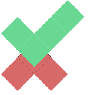

# finjan [](https://www.npmjs.com/package/finjan) [](https://github.com/omrilotan/mono/tree/master/packages/finjan)

## ☕️ Just test harmony modules

> Work in progress



```
finjan **/spec.mjs
```

All the things
```
finjan **/spec.mjs --require .finjan.mjs --ignore **/node_modules/** --verbose
```

Pass in filenames to import as tests.

### Options

| name | Value
| - | -
| require (r) | one or more files to import before the tests
| verbose (v) | Print stack trace for each error
| ignore (i) | Pattern or an array of glob patterns to exclude matches

### Structure of spec/tests file

```js
describe('my suit', function() {
	it('Should pass', function() {
		assert(!!1, true);
	});
	it('Should pass', async function() {
		assert.equal(await square(2), 4);
	});
});
```

Create a scope with `describe` and register tests with `it`

Additional methods:

| Method | Meaning
| - | -
| `before` | Runs before all `it`s in a `describe`
| `beforeEach` | Runs before each `it` in a `describe`
| `afterEach` | Runs after each `it` in a `describe`
| `after` | Runs after all `it`s in a `describe`
